# Using the CyberShuttle :rocket: VMD plugin (Tcl/Tk)
(Temporary guide) 🚧 👷‍♂️👷‍♀️

## Step 1 - Clone this repository.
```bash
git clone https://github.com/cyber-shuttle/cybershuttle-md-api.git
```

## Step 2 - Go to the TclTk-gui folder.
```bash
cd cybershuttle-md-api/TclTk-gui
```


## Pre-requisites
Secure communication with CyberShuttle requires "tcltls" which isn't shipped with VMD. Make sure to build a local top and add it to <b>~/.vmdrc</b>
```bash
lappend auto_path /home/dgomes/software/vmd_dependencies/tcltls/lib/tcltls1.7.22/
```

## Installing CyberShuttle VMD plugin
Add the path to the TclTk-gui directory to <b>~/.vmdrc</b>
```bash
lappend auto_path /home/dgomes/github/cybershuttle-md-api/TclTk-gui/
vmd_install_extension cybershuttle cybershuttle_tk "CyberShuttle Viewer"
vmd_install_extension cybershuttlesubmit cybershuttlesubmit_tk "CyberShuttle Submit"
```

## Start VMD from the command line.
```bash
vmd
```
### Open the plugin
In VMD go to Extensions->CyberShuttle Viewer
In VMD go to Extensions->CyberShuttle Submit

### It if fails... go to the plugin folder. 
```bash
cd PATH-TO/cybershuttle-md-api/TclTk-gui/
```
Open the Tk Console and manually source the plugins.
In VMD go to Extensions->Tk Console.
```bash
source CyberShuttle.tcl
source CyberShuttle_submit.tcl
source CyberShuttle_functions.tcl
```


# Using the CyberShuttle Graphical User Interface (GUI) in VMD.
## Introduction
  Welcome to this tutorial on using [CyberShuttle](https://md.cybershuttle.org with [Visual Molecular Dynamics (VMD)](https://www.ks.uiuc.edu/Research/vmd/) to perform molecular dynamics simulations. This tutorial is designed to guide you through the process of setting up and running your simulations using the CyberShuttle cyberinfrastructure. 
[CyberShuttle](https://md.cybershuttle.org) is a powerful tool that manages computational workloads and file transfers in a transparent way, allowing researchers to utilize computational resources on NSF-funded supercomputers. Powered by the Apache Airavata Framework, CyberShuttle can also be deployed to local clusters, including lab, department, and institutional clusters.

### Prerequisites
Before we begin, ensure that you have the following:
* An account on [CyberShuttle](https://md.cybershuttle.org) :rocket:.
* [Visual Molecular Dynamics (VMD)](https://www.ks.uiuc.edu/Research/vmd/) installed on your local machine.
* Basic knowledge of molecular dynamics simulations. Start here: [MD tutorials](https://www.ks.uiuc.edu/Training/Tutorials/).
* This repository.
* A build of [tcltls](https://core.tcl-lang.org/tcltls/index), since VMD 1.9.x doesn't distribute it.

## The CyberShuttle plugins
Currently there are two independet plugins **CyberShuttle Submit** and **CyberShuttle View**. Calm down, it's a work in progress :construction:. They will be merged into a single plugin and redesigned after the [_61st Hands-on Workshop on Computational Biophysics_](https://www.ks.uiuc.edu/Training/Workshop/Auburn2024/). 

To communicate securely with CyberShuttle both plugins you need a session **token**. A session **token** is a unique identifier, that is used to track and authenticate a user’s interaction with a server during a session. It’s an essential part of maintaining **secure** user sessions on the web. Right now, CyberShuttle token lasts for 10 minutes, you need to get a new token after that.

### CyberShuttle Submit
Submiting a job to CyberShuttle one needs to get a token, provide the input files, and submit the job.
Go ahead and setup you system using QwikMD, Charmm-GUI, manually, using psfgen.
In VMD2, cybershuttle submit will also be intergrated in QwikMD.
* CyberShuttle allows and additional post-processing .tcl to be submited 🏗️🚧
  
Open VMD and click on _Extensions->CyberShuttle Submit_. The **CyberShuttle Submit** plugin will pop up. Now click on **Get token**. A _webBrowser_ will open and you'll be guided to login using your ACCESS our University account. Once done, copy the token and click on **Apply**

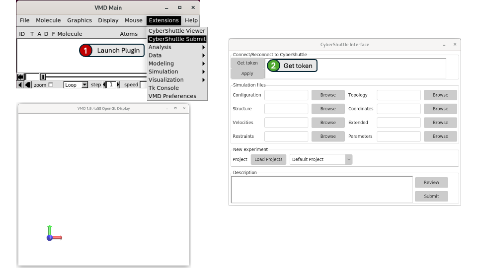
*To use the CyberShuttle Submit plugins. In VMD Main meni, click on Extensions->CyberShuttle Submit. It will open the plugin window*

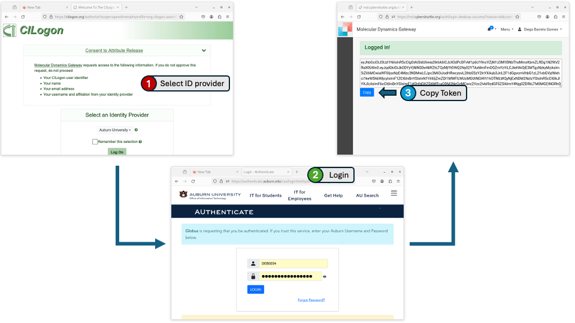
*The 3 steps to get a token. **Get token** will open a web browser, where you can login to CyberShuttle using your Institutional credentials.*

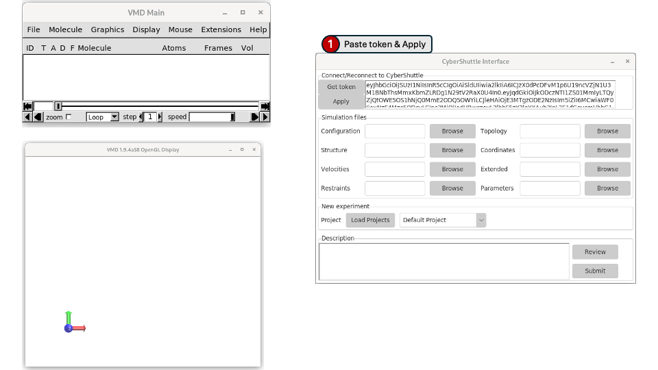
*Once you copy the token, paste into the toke field and click Apply.*

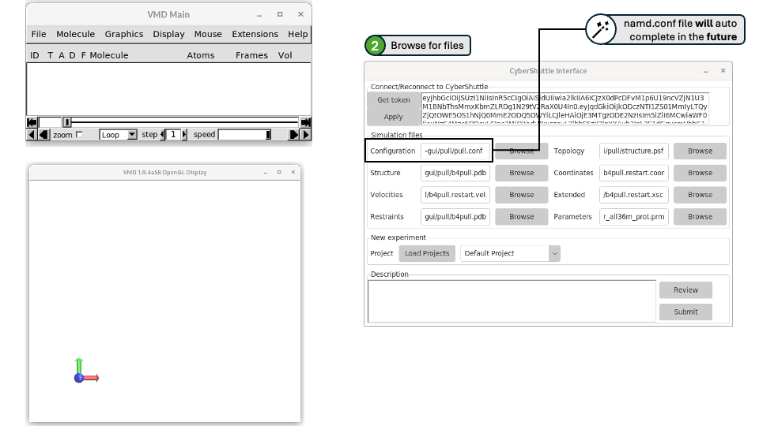
*Fill the forms by browsing you Molecular Dynamics input files, starting by the NAMD configuration file (.conf). Fill the other fields accordingly to what's defined in the .conf file, including the Topology, Structure, Coordinates, Velocities, Extended system, Restraints, and Parameters.*

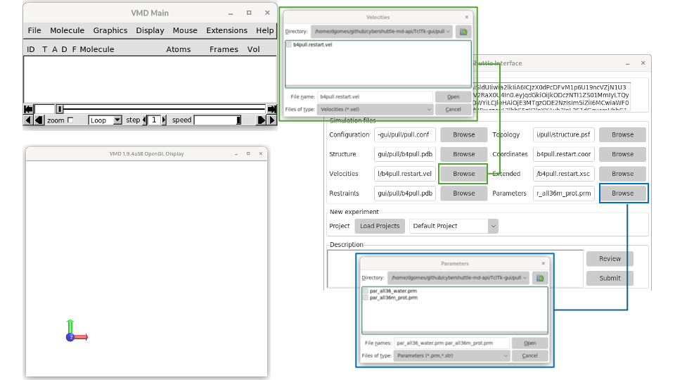
*Each Browse button helps you find the files with the relevant extension, NAMD configuration files (.conf/.namd), Velocities (.vel), Structure (.pdb), Coordinates (.coor/.pdb), Parameters (.prm,.str)*

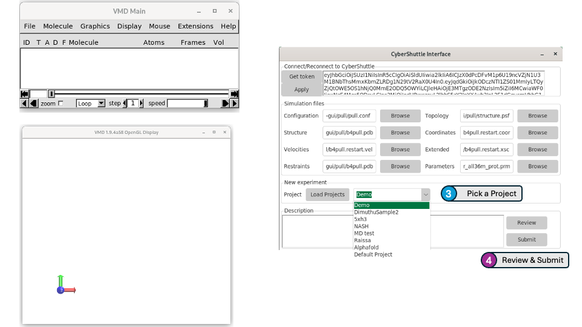
*Once you're done, select an project, review your options and submit! Happy simulations!*

### CyberShuttle View
**CyberShuttle View** allows users to view the list their experiments and review their status, download whole experiments and/or individual files. In addition one can select a Topology/Trajectory pair and load in VMD right away! 

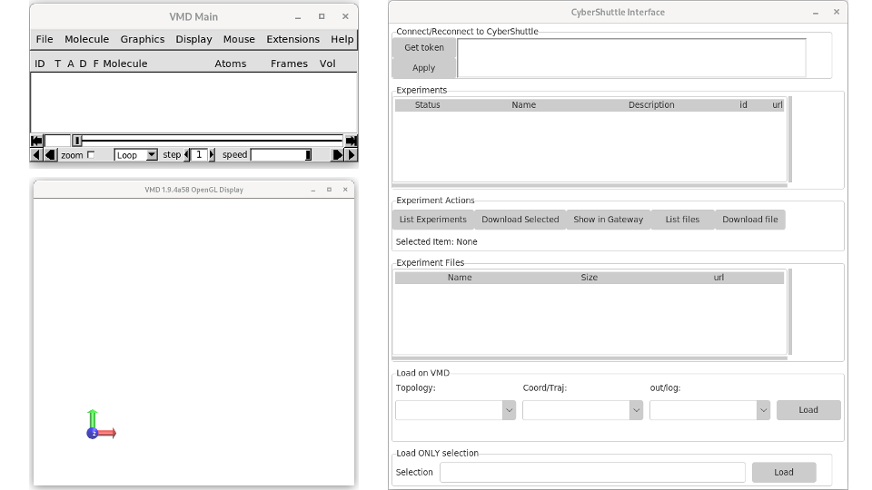
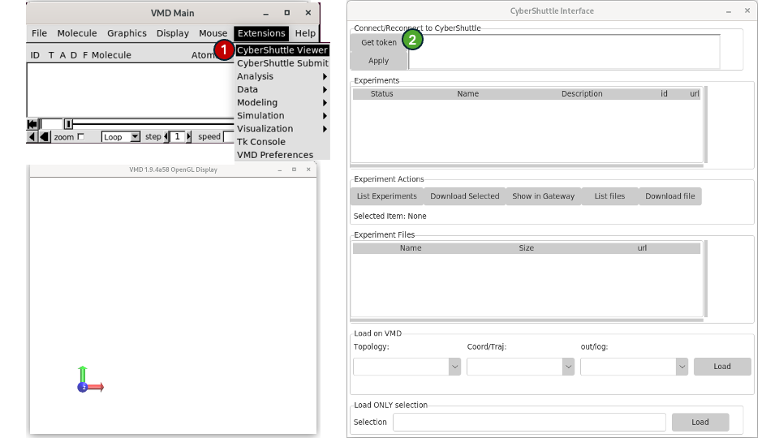


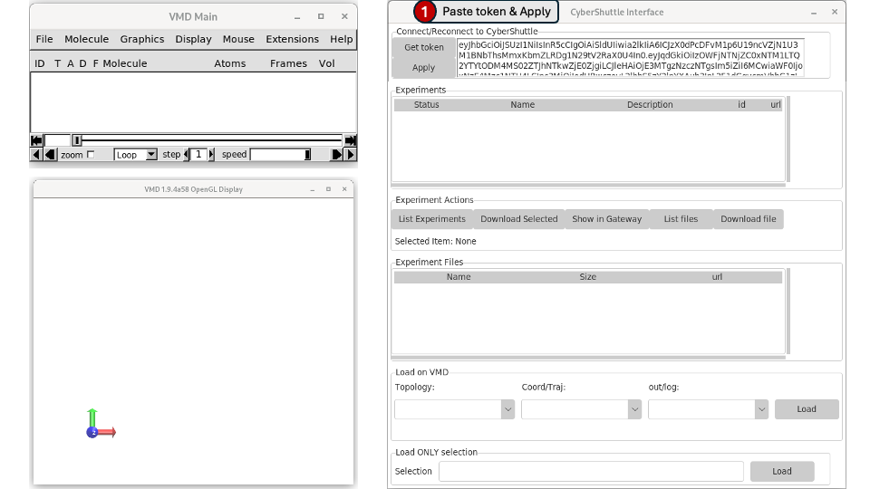
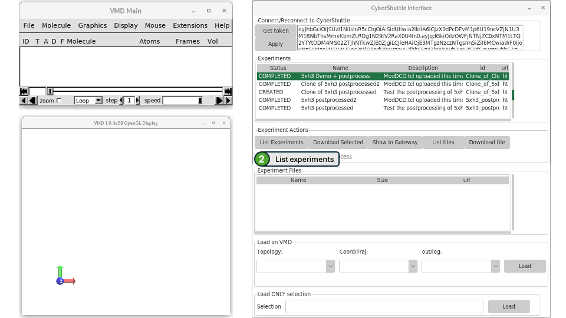
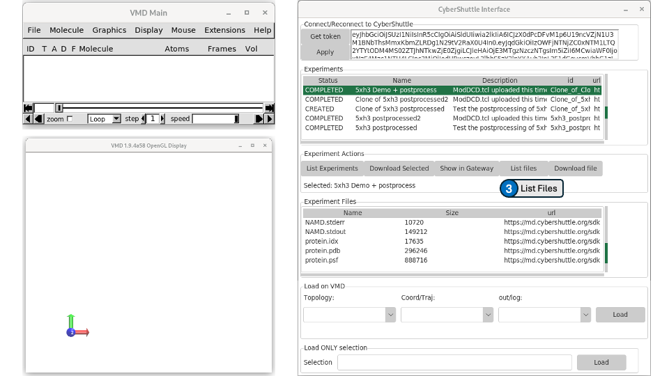
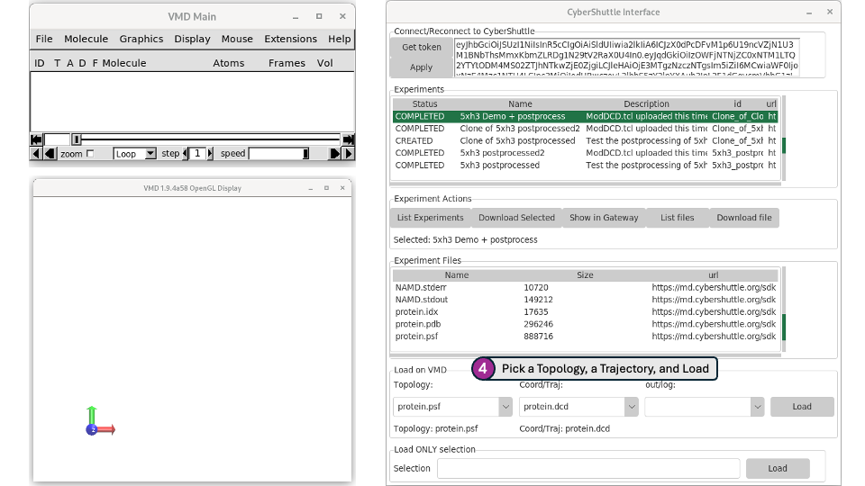
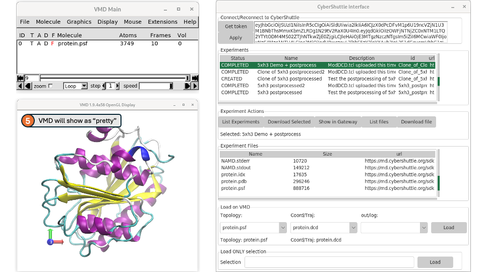
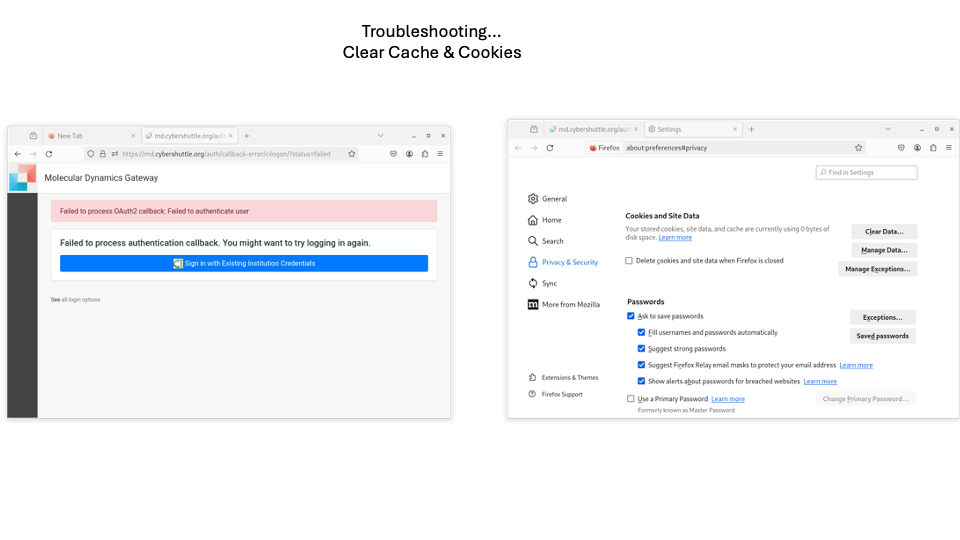


Step 1: Setting Up Your Workspace on md.cybershuttle.org
Log in to your account on md.cybershuttle.org.
Navigate to the workspace and create a new project for your molecular dynamics simulation.
Step 2: Preparing Your Molecular System in VMD
Open VMD on your local machine.
Load your molecular system into VMD.
Use the VMD tools to prepare your system for simulation. This may include adding hydrogen atoms, solvating the system, and adding ions.
Step 3: Uploading Your System to md.cybershuttle.org
Save your prepared system in a format compatible with the simulation software you plan to use (e.g., GROMACS, AMBER, NAMD).
Upload the system files to your project on md.cybershuttle.org.
Step 4: Running Your Simulation on md.cybershuttle.org
Set up your simulation parameters on md.cybershuttle.org.
Submit your simulation job. The CyberShuttle infrastructure will manage the computational workload and file transfers.
Step 5: Analyzing Your Results
Once your simulation is complete, you can download the results for analysis. You can use VMD or other analysis tools to examine the behavior of your molecular system.
Conclusion
This tutorial provided a basic overview of how to use md.cybershuttle.org with VMD to perform molecular dynamics simulations. Remember, the CyberShuttle infrastructure is a powerful tool that can help streamline your research and make efficient use of computational resources.
Please note that this is a basic draft and you might need to add or modify steps based on the specific requirements of your simulation and the features of the md.cybershuttle.org platform. Happy simulating!


